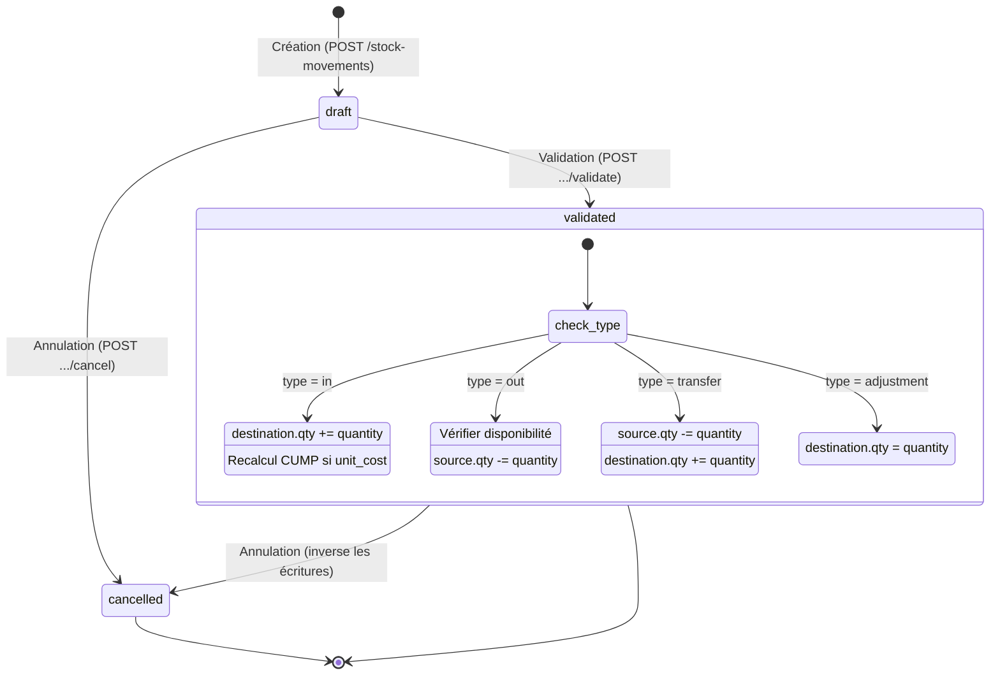
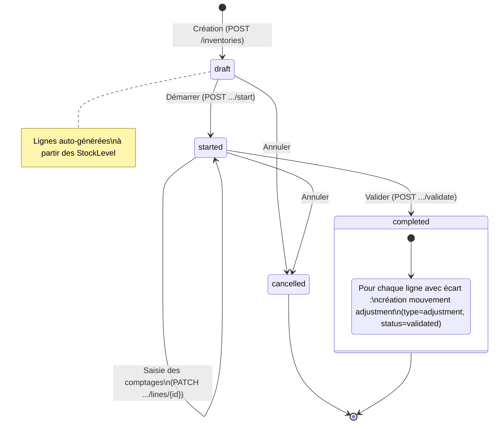
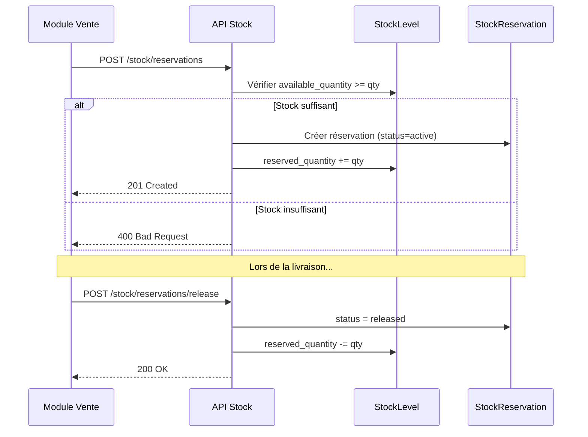
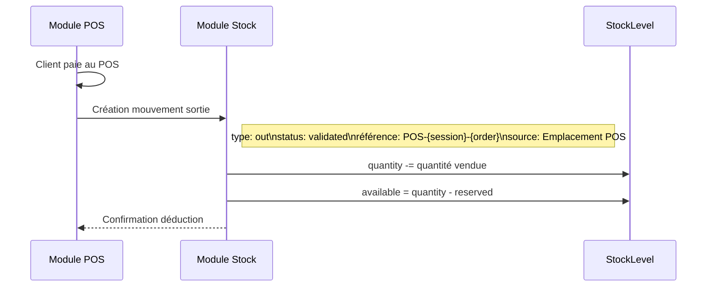
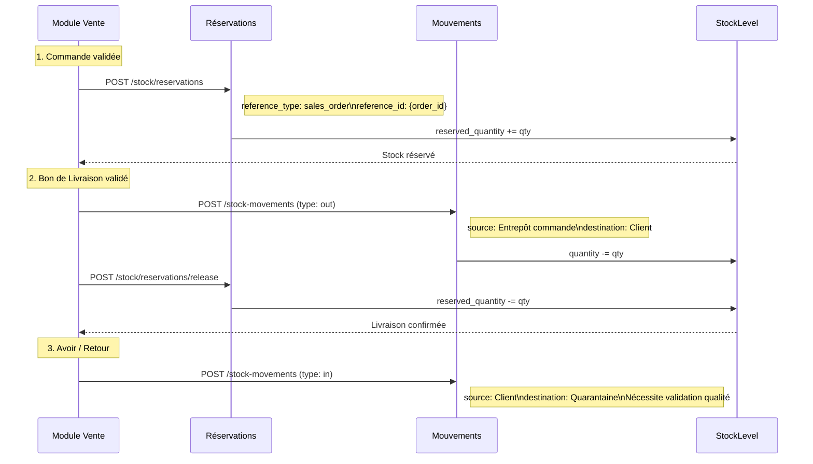
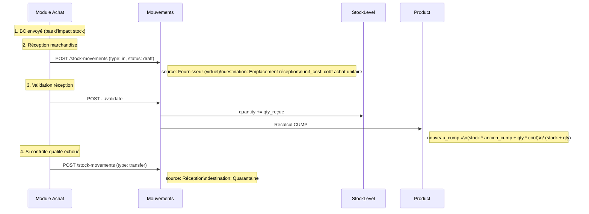
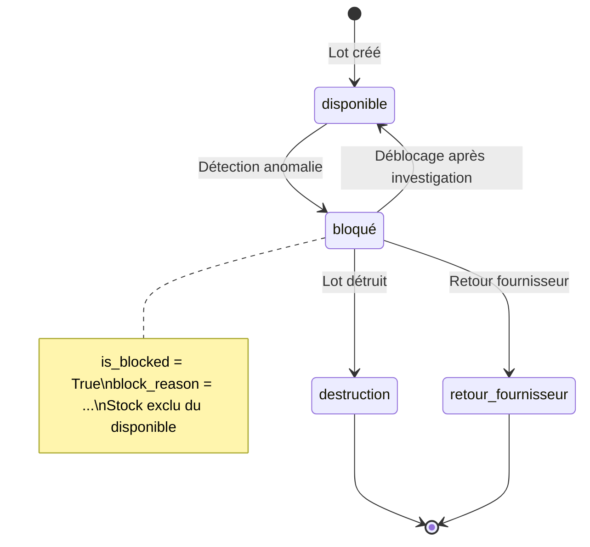
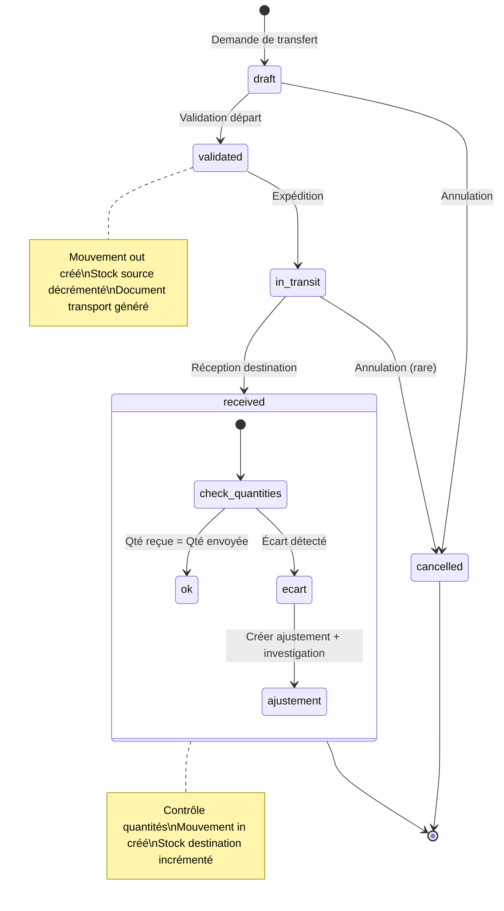

# 📦 Module Stock — Documentation Technique Complète

> **Version** : 1.0
> **Date** : 2026-02-16
> **Architecture** : FastAPI (Python) + React (TypeScript) + PostgreSQL
> **Principes** : Multi-tenant (`company_id`), Soft delete (`is_active`), RBAC, Audit trail

---

## 📑 Table des Matières

1. [Vue d'ensemble](#1--vue-densemble)
2. [Principes architecturaux](#2--principes-architecturaux)
3. [Modèles de données](#3--modèles-de-données)
   - 3.1 [ProductCategory](#31-productcategory)
   - 3.2 [Product](#32-product)
   - 3.3 [Warehouse](#33-warehouse)
   - 3.4 [StockLocation](#34-stocklocation)
   - 3.5 [Lot](#35-lot)
   - 3.6 [StockLevel](#36-stocklevel)
   - 3.7 [StockMovement](#37-stockmovement)
   - 3.8 [Inventory / InventoryLine](#38-inventory--inventoryline)
   - 3.9 [StockReservation](#39-stockreservation)
   - 3.10 [ProductBarcode](#310-productbarcode)
   - 3.11 [UnitOfMeasure (à implémenter)](#311-unitofmeasure--à-implémenter)
   - 3.12 [ProductVariant (à implémenter)](#312-productvariant--à-implémenter)
   - 3.13 [StockTransfer (à implémenter)](#313-stocktransfer--à-implémenter)
   - 3.14 [InventoryCycle (à implémenter)](#314-inventorycycle--à-implémenter)
4. [Permissions RBAC](#4--permissions-rbac)
5. [Endpoints API](#5--endpoints-api)
   - 5.1 [Produits](#51-produits)
   - 5.2 [Catégories](#52-catégories)
   - 5.3 [Entrepôts & Emplacements](#53-entrepôts--emplacements)
   - 5.4 [Lots](#54-lots)
   - 5.5 [Mouvements de stock](#55-mouvements-de-stock)
   - 5.6 [Inventaires](#56-inventaires)
   - 5.7 [Réservations](#57-réservations)
   - 5.8 [Tableau de bord & KPIs](#58-tableau-de-bord--kpis)
   - 5.9 [Réapprovisionnement](#59-réapprovisionnement)
6. [Exemples de payloads JSON](#6--exemples-de-payloads-json)
7. [Workflows & Diagrammes](#7--workflows--diagrammes)
   - 7.1 [Mouvement de stock](#71-workflow-mouvement-de-stock)
   - 7.2 [Inventaire](#72-workflow-inventaire)
   - 7.3 [Réservation](#73-workflow-réservation)
8. [Intégration POS → Stock](#8--intégration-pos--stock)
9. [Intégration Vente → Stock](#9--intégration-vente--stock)
10. [Intégration Achat → Stock](#10--intégration-achat--stock)
11. [Système d'alertes automatiques](#11--système-dalertes-automatiques)
12. [Réapprovisionnement & Classification ABC](#12--réapprovisionnement--classification-abc)
13. [Inventaire tournant](#13--inventaire-tournant)
14. [Blocage de lot](#14--blocage-de-lot)
15. [Transferts inter-entrepôts](#15--transferts-inter-entrepôts)
16. [Unités de mesure](#16--unités-de-mesure)
17. [Photos produits](#17--photos-produits)
18. [Variantes produits](#18--variantes-produits)
19. [Règles métier](#19--règles-métier)

---

## 1. 🔭 Vue d'ensemble

Le module Stock gère l'ensemble du cycle de vie des articles et de leur inventaire :

- **Catalogue produits** avec catégories hiérarchiques, codes-barres multiples, classification ABC
- **Entrepôts & emplacements** (allée / étagère / bac), types d'emplacement (stockage, quarantaine, retours)
- **Niveaux de stock** par produit × emplacement × lot, avec quantité physique, réservée et disponible
- **Mouvements** (entrée, sortie, transfert, ajustement) avec workflow brouillon → validé → annulé
- **Lots & traçabilité** (suivi par lot ou numéro de série, dates de péremption)
- **Inventaires** avec auto-population des lignes et création automatique d'ajustements
- **Réservations** liées à des commandes de vente / fabrication
- **Réapprovisionnement** : suggestions automatiques, calcul des points de commande, classification ABC
- **Valorisation** : méthode CUMP (Coût Unitaire Moyen Pondéré)

### Fichiers clés

| Couche | Chemin | Description |
|--------|--------|-------------|
| Modèles | `backend/app/models/stock.py` | 10 modèles SQLAlchemy |
| Schémas | `backend/app/schemas/stock.py` | Pydantic v2 (validation API) |
| Services | `backend/app/services/product.py` | Logique produit |
| | `backend/app/services/stock_movement.py` | Logique mouvements |
| | `backend/app/services/inventory.py` | Logique inventaire |
| | `backend/app/services/reservation.py` | Logique réservations |
| | `backend/app/services/replenishment.py` | Suggestions réappro & ABC |
| | `backend/app/services/barcode.py` | Gestion codes-barres |
| | `backend/app/services/stock_dashboard.py` | KPIs & alertes |
| | `backend/app/services/warehouse.py` | Entrepôts & emplacements |
| | `backend/app/services/lot.py` | Lots |
| | `backend/app/services/category.py` | Catégories |
| Routes | `backend/app/routers/stock.py` | Endpoints API REST |
| Frontend | `frontend/src/pages/stock/` | Pages React |
| | `frontend/src/services/stock.ts` | Appels API |
| | `frontend/src/types/stock.ts` | Types TypeScript |

---

## 2. 🏗️ Principes architecturaux

### Champs communs à TOUS les modèles

Chaque modèle hérite de `Base` et inclut automatiquement :

| Champ | Type | Description |
|-------|------|-------------|
| `id` | `Integer (PK)` | Identifiant auto-incrémenté |
| `company_id` | `Integer (FK → companies.id)` | Isolation multi-tenant — **obligatoire** |
| `is_active` | `Boolean (défaut True)` | Soft delete |
| `created_at` | `DateTime(tz)` | Date de création (auto `now()`) |
| `updated_at` | `DateTime(tz)` | Dernière modification (auto `now()`) |

> **Règle** : Tout SELECT inclut un filtre `company_id = :current_company_id`. Aucun accès cross-tenant n'est possible sauf pour le rôle `SUPER_ADMIN`.

### Multi-tenant

- Chaque entité est liée à une `Company` via `company_id` (FK, `ondelete=CASCADE`)
- Les services filtrent systématiquement par `company_id`
- Le `SUPER_ADMIN` peut accéder à toutes les sociétés

### Soft delete

- Désactivation via `is_active = False` (pas de `DELETE` physique)
- Les listes filtrent par `is_active = True` par défaut (sauf option `include_inactive`)

### Audit trail

- `created_at` / `updated_at` automatiques via `server_default=func.now()`
- `created_by_id` / `validated_by_id` sur les entités avec workflow

---

## 3. 📊 Modèles de données

### 3.1 ProductCategory

**Table** : `product_categories`

| Champ | Type | Contraintes | Description |
|-------|------|-------------|-------------|
| `id` | Integer | PK | — |
| `name` | String | NOT NULL | Nom de la catégorie |
| `code` | String | NOT NULL, indexed, unique(+company_id) | Code court |
| `description` | Text | nullable | Description libre |
| `parent_id` | Integer | FK → product_categories.id, SET NULL | Catégorie parente (hiérarchie) |
| `company_id` | Integer | FK → companies.id, CASCADE | Isolation tenant |
| `is_active` | Boolean | default True | Soft delete |
| `created_at` | DateTime(tz) | auto | — |
| `updated_at` | DateTime(tz) | auto | — |

**Relations** : `parent` (self), `children` (list), `products` (list), `company`

---

### 3.2 Product

**Table** : `products`

| Champ | Type | Contraintes | Description |
|-------|------|-------------|-------------|
| `id` | Integer | PK | — |
| `sku` | String | NOT NULL, indexed, unique(+company_id) | Référence article |
| `barcode` | String | nullable, indexed | Code-barres principal (legacy) |
| `name` | String | NOT NULL | Nom de l'article |
| `description` | Text | nullable | Description longue |
| `category_id` | Integer | FK → product_categories.id, SET NULL | Catégorie |
| `product_type` | String | default `"stockable"` | `stockable`, `service`, `consumable` |
| `unit_of_measure` | String | default `"pce"` | Unité de mesure |
| `sale_price` | Numeric(12,2) | default 0 | Prix de vente HT |
| `cost_price` | Numeric(12,2) | default 0 | Prix de revient (CUMP) |
| `tax_rate` | Numeric(5,2) | default 20.00 | Taux de TVA |
| `tracking_type` | String | default `"none"` | `none`, `batch`, `serial` |
| `valuation_method` | String | default `"cump"` | Méthode de valorisation |
| `min_stock_level` | Numeric(12,3) | default 0 | Stock minimum |
| `max_stock_level` | Numeric(12,3) | default 0 | Stock maximum |
| `reorder_point` | Numeric(12,3) | default 0 | Point de commande |
| `reorder_quantity` | Numeric(12,3) | default 0 | Quantité de réapprovisionnement |
| `optimal_order_quantity` | Numeric(12,3) | default 0 | Qté optimale (calculée) |
| `weight` | Numeric(10,3) | nullable | Poids unitaire |
| `image_url` | String | nullable | URL image principale |
| `lead_time_days` | Integer | default 0 | Délai d'approvisionnement |
| `average_daily_consumption` | Numeric(12,3) | default 0 | Consommation moyenne quotidienne (calculée) |
| `abc_classification` | String(1) | nullable | Classification ABC : `A`, `B`, `C` |
| `is_active` | Boolean | default True | Soft delete |
| `company_id` | Integer | FK → companies.id, CASCADE | Isolation tenant |
| `created_at` | DateTime(tz) | auto | — |
| `updated_at` | DateTime(tz) | auto | — |

**Relations** : `category`, `lots`, `stock_levels`, `company`

---

### 3.3 Warehouse

**Table** : `warehouses`

| Champ | Type | Contraintes | Description |
|-------|------|-------------|-------------|
| `id` | Integer | PK | — |
| `name` | String | NOT NULL | Nom de l'entrepôt |
| `code` | String | NOT NULL, indexed, unique(+company_id) | Code court |
| `address` | Text | nullable | Adresse physique |
| `is_active` | Boolean | default True | Soft delete |
| `company_id` | Integer | FK → companies.id, CASCADE | Isolation tenant |
| `created_at` | DateTime(tz) | auto | — |
| `updated_at` | DateTime(tz) | auto | — |

**Relations** : `locations` (list), `company`

---

### 3.4 StockLocation

**Table** : `stock_locations`

| Champ | Type | Contraintes | Description |
|-------|------|-------------|-------------|
| `id` | Integer | PK | — |
| `warehouse_id` | Integer | FK → warehouses.id, CASCADE | Entrepôt parent |
| `name` | String | NOT NULL | Nom de l'emplacement |
| `code` | String | NOT NULL, indexed | Code court |
| `aisle` | String | nullable | Allée |
| `shelf` | String | nullable | Étagère |
| `bin` | String | nullable | Bac |
| `location_type` | String | default `"storage"` | `storage`, `quarantine`, `returns`, `production`, `virtual` |
| `is_active` | Boolean | default True | Soft delete |
| `company_id` | Integer | FK → companies.id, CASCADE | Isolation tenant |
| `created_at` | DateTime(tz) | auto | — |
| `updated_at` | DateTime(tz) | auto | — |

**Relations** : `warehouse`, `stock_levels` (list), `company`

---

### 3.5 Lot

**Table** : `lots`

| Champ | Type | Contraintes | Description |
|-------|------|-------------|-------------|
| `id` | Integer | PK | — |
| `product_id` | Integer | FK → products.id, CASCADE | Produit associé |
| `lot_number` | String | NOT NULL, indexed, unique(+product_id) | Numéro de lot |
| `expiry_date` | Date | nullable | Date de péremption |
| `best_before_date` | Date | nullable | Date limite d'utilisation optimale |
| `manufacturing_date` | Date | nullable | Date de fabrication |
| `supplier_id` | Integer | FK → third_parties.id, SET NULL | Fournisseur d'origine |
| `notes` | Text | nullable | Notes libres |
| `is_active` | Boolean | default True | Soft delete |
| `company_id` | Integer | FK → companies.id, CASCADE | Isolation tenant |
| `created_at` | DateTime(tz) | auto | — |
| `updated_at` | DateTime(tz) | auto | — |

**Relations** : `product`, `supplier` (ThirdParty), `stock_levels` (list), `company`

> **⚠️ À implémenter** : champs de blocage (`is_blocked`, `block_reason`, etc.) — voir [section 14](#14--blocage-de-lot)

---

### 3.6 StockLevel

**Table** : `stock_levels`

| Champ | Type | Contraintes | Description |
|-------|------|-------------|-------------|
| `id` | Integer | PK | — |
| `product_id` | Integer | FK → products.id, CASCADE | Produit |
| `location_id` | Integer | FK → stock_locations.id, CASCADE | Emplacement |
| `lot_id` | Integer | FK → lots.id, SET NULL | Lot (optionnel) |
| `quantity` | Numeric(12,3) | default 0 | Quantité physique |
| `reserved_quantity` | Numeric(12,3) | default 0 | Quantité réservée |
| `company_id` | Integer | FK → companies.id, CASCADE | Isolation tenant |
| `created_at` | DateTime(tz) | auto | — |
| `updated_at` | DateTime(tz) | auto | — |

**Propriété calculée** :
```python
available_quantity = quantity - reserved_quantity
```

**Relations** : `product`, `location`, `lot`, `company`

> **Grain** : Un enregistrement par combinaison unique `(product_id, location_id, lot_id)`.

---

### 3.7 StockMovement

**Table** : `stock_movements`

| Champ | Type | Contraintes | Description |
|-------|------|-------------|-------------|
| `id` | Integer | PK | — |
| `reference` | String | NOT NULL, unique, indexed | Auto-généré : `MOV-YYYYMMDD-####` |
| `movement_type` | String | NOT NULL | `in`, `out`, `transfer`, `adjustment` |
| `product_id` | Integer | FK → products.id, CASCADE | Produit concerné |
| `lot_id` | Integer | FK → lots.id, SET NULL | Lot (optionnel) |
| `source_location_id` | Integer | FK → stock_locations.id, SET NULL | Emplacement source |
| `destination_location_id` | Integer | FK → stock_locations.id, SET NULL | Emplacement destination |
| `quantity` | Numeric(12,3) | NOT NULL | Quantité mouvementée |
| `unit_cost` | Numeric(12,2) | nullable | Coût unitaire (pour recalcul CUMP sur entrée) |
| `status` | String | default `"draft"` | `draft`, `validated`, `cancelled` |
| `reason` | Text | nullable | Motif du mouvement |
| `notes` | Text | nullable | Notes complémentaires |
| `validated_by_id` | Integer | FK → users.id, SET NULL | Utilisateur valideur |
| `validated_at` | DateTime(tz) | nullable | Date de validation |
| `company_id` | Integer | FK → companies.id, CASCADE | Isolation tenant |
| `created_at` | DateTime(tz) | auto | — |
| `updated_at` | DateTime(tz) | auto | — |

**Relations** : `product`, `lot`, `source_location`, `destination_location`, `validated_by`, `company`

**Types de mouvement** :

| Type | Source requise | Destination requise | Effet sur stock |
|------|:---:|:---:|---|
| `in` | ✗ | ✓ | `destination.quantity += qty` + recalcul CUMP |
| `out` | ✓ | ✗ | `source.quantity -= qty` (vérifie disponibilité) |
| `transfer` | ✓ | ✓ | `source -= qty`, `destination += qty` |
| `adjustment` | ✗ | ✓ | `destination.quantity = qty` (valeur absolue) |

---

### 3.8 Inventory / InventoryLine

#### Inventory

**Table** : `inventories`

| Champ | Type | Contraintes | Description |
|-------|------|-------------|-------------|
| `id` | Integer | PK | — |
| `reference` | String | NOT NULL, unique, indexed | Auto-généré : `INV-YYYYMMDD-####` |
| `name` | String | NOT NULL | Libellé de l'inventaire |
| `warehouse_id` | Integer | FK → warehouses.id, CASCADE | Entrepôt cible |
| `status` | String | default `"draft"` | `draft`, `started`, `completed`, `cancelled` |
| `started_at` | DateTime(tz) | nullable | Date de début effectif |
| `completed_at` | DateTime(tz) | nullable | Date de fin |
| `notes` | Text | nullable | Notes |
| `created_by_id` | Integer | FK → users.id, SET NULL | Créateur |
| `company_id` | Integer | FK → companies.id, CASCADE | Isolation tenant |
| `created_at` | DateTime(tz) | auto | — |
| `updated_at` | DateTime(tz) | auto | — |

**Relations** : `warehouse`, `lines` (cascade delete), `created_by`, `company`

#### InventoryLine

**Table** : `inventory_lines`

| Champ | Type | Contraintes | Description |
|-------|------|-------------|-------------|
| `id` | Integer | PK | — |
| `inventory_id` | Integer | FK → inventories.id, CASCADE | Inventaire parent |
| `product_id` | Integer | FK → products.id, CASCADE | Produit |
| `location_id` | Integer | FK → stock_locations.id, CASCADE | Emplacement |
| `lot_id` | Integer | FK → lots.id, SET NULL | Lot (optionnel) |
| `expected_quantity` | Numeric(12,3) | default 0 | Quantité théorique (snapshot) |
| `counted_quantity` | Numeric(12,3) | nullable | Quantité comptée |
| `notes` | Text | nullable | Notes |

**Propriété calculée** :
```python
difference = counted_quantity - expected_quantity  # si counted_quantity renseigné
```

**Relations** : `inventory`, `product`, `location`, `lot`

---

### 3.9 StockReservation

**Table** : `stock_reservations`

| Champ | Type | Contraintes | Description |
|-------|------|-------------|-------------|
| `id` | Integer | PK | — |
| `product_id` | Integer | FK → products.id, CASCADE | Produit réservé |
| `location_id` | Integer | FK → stock_locations.id, CASCADE | Emplacement |
| `lot_id` | Integer | FK → lots.id, SET NULL | Lot (optionnel) |
| `quantity` | Numeric(12,3) | NOT NULL | Quantité réservée |
| `reference_type` | String | NOT NULL | `sales_order`, `purchase_order`, `production_order` |
| `reference_id` | Integer | nullable | ID de l'entité liée |
| `reference_label` | String | nullable | Libellé affiché |
| `reserved_by_id` | Integer | FK → users.id, SET NULL | Utilisateur ayant réservé |
| `reserved_date` | DateTime(tz) | default `now()` | Date de réservation |
| `expiry_date` | DateTime(tz) | nullable | Date d'expiration auto |
| `status` | String | default `"active"` | `active`, `released`, `expired` |
| `notes` | Text | nullable | Notes |
| `company_id` | Integer | FK → companies.id, CASCADE | Isolation tenant |
| `created_at` | DateTime(tz) | auto | — |
| `updated_at` | DateTime(tz) | auto | — |

**Relations** : `product`, `location`, `lot`, `reserved_by`, `company`

---

### 3.10 ProductBarcode

**Table** : `product_barcodes`

| Champ | Type | Contraintes | Description |
|-------|------|-------------|-------------|
| `id` | Integer | PK | — |
| `product_id` | Integer | FK → products.id, CASCADE | Produit |
| `barcode` | String | NOT NULL, indexed, globally unique | Code-barres |
| `barcode_type` | String | default `"EAN13"` | `EAN13`, `CODE128`, `UPC`, `QR` |
| `is_primary` | Boolean | default False | Code-barres principal |
| `company_id` | Integer | FK → companies.id, CASCADE | Isolation tenant |
| `created_at` | DateTime(tz) | auto | — |
| `updated_at` | DateTime(tz) | auto | — |

**Relations** : `product`, `company`

---

### 3.11 UnitOfMeasure — 🔮 À implémenter

**Table** : `units_of_measure`

| Champ | Type | Contraintes | Description |
|-------|------|-------------|-------------|
| `id` | Integer | PK | — |
| `name` | String | NOT NULL | Nom complet (ex: `Kilogramme`) |
| `symbol` | String | NOT NULL | Symbole court (ex: `kg`) |
| `category` | Enum | NOT NULL | `weight`, `volume`, `length`, `unit`, `time`, `surface` |
| `base_unit_id` | Integer | FK → units_of_measure.id, nullable | Unité de référence |
| `conversion_factor` | Numeric | NOT NULL, default 1 | Facteur de conversion vers l'unité de base |
| `company_id` | Integer | FK → companies.id, CASCADE | Isolation tenant |
| `is_active` | Boolean | default True | Soft delete |
| `created_at` | DateTime(tz) | auto | — |
| `updated_at` | DateTime(tz) | auto | — |

**Exemples** :

| Nom | Symbole | Catégorie | Base | Facteur |
|-----|---------|-----------|------|---------|
| Kilogramme | kg | weight | — (base) | 1 |
| Gramme | g | weight | kg | 0.001 |
| Litre | L | volume | — (base) | 1 |
| Millilitre | mL | volume | L | 0.001 |
| Pièce | pcs | unit | — (base) | 1 |
| Carton (24) | ctn | unit | pcs | 24 |

**Impact sur Product** :
- `Product.unit_id` → FK vers UnitOfMeasure (unité de vente)
- `Product.purchase_unit_id` → FK vers UnitOfMeasure (unité d'achat, peut différer)
- Conversion automatique : *"Acheté en cartons (24 pcs), vendu à l'unité"*

---

### 3.12 ProductVariant — 🔮 À implémenter

**Table** : `product_variants`

| Champ | Type | Contraintes | Description |
|-------|------|-------------|-------------|
| `id` | Integer | PK | — |
| `product_id` | Integer | FK → products.id, CASCADE | Produit parent |
| `sku` | String | NOT NULL, unique(+company_id) | Code unique de la variante |
| `name` | String | NOT NULL | Nom complet (ex: `T-shirt Bleu - M`) |
| `attributes` | JSON | NOT NULL | Attributs clé-valeur |
| `price_differential` | Numeric(12,2) | default 0 | Écart de prix vs produit parent |
| `barcode` | String | nullable | Code-barres spécifique |
| `is_active` | Boolean | default True | Soft delete |
| `company_id` | Integer | FK → companies.id, CASCADE | Isolation tenant |
| `created_at` | DateTime(tz) | auto | — |
| `updated_at` | DateTime(tz) | auto | — |

**Exemple d'attributs** :
```json
{ "taille": "M", "couleur": "Bleu", "matiere": "Coton" }
```

**Gestion du stock** : Chaque variante a son propre `StockLevel`. Le stock total produit = somme des variantes actives.

---

### 3.13 StockTransfer — 🔮 À implémenter

**Table** : `stock_transfers`

| Champ | Type | Contraintes | Description |
|-------|------|-------------|-------------|
| `id` | Integer | PK | — |
| `reference` | String | NOT NULL, unique | `TRF-YYYYMMDD-####` |
| `source_warehouse_id` | Integer | FK → warehouses.id | Entrepôt source |
| `destination_warehouse_id` | Integer | FK → warehouses.id | Entrepôt destination |
| `status` | Enum | default `"draft"` | `draft`, `validated`, `in_transit`, `received`, `cancelled` |
| `transfer_date` | Date | NOT NULL | Date de transfert |
| `expected_arrival_date` | Date | nullable | Date d'arrivée prévue |
| `actual_arrival_date` | Date | nullable | Date d'arrivée effective |
| `transporter` | String | nullable | Transporteur |
| `tracking_number` | String | nullable | Numéro de suivi |
| `notes` | Text | nullable | Notes |
| `company_id` | Integer | FK → companies.id, CASCADE | Isolation tenant |
| `created_at` | DateTime(tz) | auto | — |
| `updated_at` | DateTime(tz) | auto | — |

**Table** : `stock_transfer_lines`

| Champ | Type | Description |
|-------|------|-------------|
| `id` | Integer PK | — |
| `transfer_id` | FK → stock_transfers.id | Transfert parent |
| `product_id` | FK → products.id | Produit |
| `lot_id` | FK → lots.id, nullable | Lot |
| `quantity_sent` | Numeric(12,3) | Quantité envoyée |
| `quantity_received` | Numeric(12,3), nullable | Quantité reçue |

---

### 3.14 InventoryCycle — 🔮 À implémenter

**Table** : `inventory_cycles`

| Champ | Type | Contraintes | Description |
|-------|------|-------------|-------------|
| `id` | Integer | PK | — |
| `name` | String | NOT NULL | Ex: `Cycle Janvier 2026 - Catégorie A` |
| `frequency` | Enum | NOT NULL | `monthly`, `quarterly`, `yearly` |
| `classification` | Enum | nullable | `A`, `B`, `C`, `all` |
| `category_id` | Integer | FK, nullable | Catégorie de produits ciblée |
| `warehouse_id` | Integer | FK → warehouses.id | Entrepôt |
| `start_date` | Date | NOT NULL | Date de début |
| `end_date` | Date | NOT NULL | Date de fin |
| `assigned_to_id` | Integer | FK → users.id | Magasinier assigné |
| `status` | Enum | default `"planned"` | `planned`, `in_progress`, `completed` |
| `company_id` | Integer | FK → companies.id, CASCADE | Isolation tenant |
| `created_at` | DateTime(tz) | auto | — |
| `updated_at` | DateTime(tz) | auto | — |

---

## 4. 🔐 Permissions RBAC

### Système de permissions

Le module utilise un RBAC à granularité fine : `module.action`.

**Vérification** : La dépendance `PermissionChecker` intercepte chaque endpoint et vérifie que le rôle de l'utilisateur inclut la permission requise. Le wildcard `*.*` ou `stock.*` couvre toutes les actions du module.

### Permissions du module stock

| Permission | Description |
|-----------|-------------|
| `stock.view` | Consulter produits, stock, mouvements, inventaires |
| `stock.create` | Créer produits, mouvements, inventaires, réservations |
| `stock.edit` | Modifier produits, mouvements brouillon, lignes inventaire |
| `stock.delete` | Supprimer catégories, emplacements, codes-barres |
| `stock.validate` | Valider/annuler mouvements et inventaires |
| `stock.export` | Exporter les données stock |

### Permissions par rôle

| Rôle | Code | Permissions stock | Portée |
|------|------|-------------------|--------|
| **Super Admin** | `super_admin` | `*.*` (toutes) | Multi-société |
| **Gérant** | `manager` | `stock.*` | Société courante |
| **Magasinier** | `warehouse_clerk` | `stock.*` | Société courante |
| **Vendeur** | `seller` | `stock.view` | Lecture seule (consultation disponibilité) |
| **Caissier** | `cashier` | — (accès via POS uniquement) | Pas d'accès direct au module stock |
| **Comptable** | `accountant` | `stock.view` (via sales/purchase) | Lecture seule (valorisation comptable) |

### Actions nécessitant validation PIN

| Action | Seuil | Rôles autorisés |
|--------|-------|-----------------|
| Ajustement de stock manuel | Toujours | `GERANT`, `MAGASINIER` |
| Validation inventaire avec écarts > seuil | Écart > 5% | `GERANT` |
| Annulation d'un mouvement validé | Toujours | `GERANT` |
| Remise au-delà du seuil | `Company.discount_pin_threshold` (%) | `GERANT` |
| Vente au-delà du seuil | `Company.sale_validation_threshold` (montant) | `GERANT` |

---

## 5. 🌐 Endpoints API

Base URL : `/api/v1`

### 5.1 Produits

| Méthode | Endpoint | Permission | Description |
|---------|----------|-----------|-------------|
| `GET` | `/products` | `stock.view` | Liste paginée (filtres: category, type, tracking_type, search, is_active) |
| `POST` | `/products` | `stock.create` | Créer un produit |
| `GET` | `/products/{id}` | `stock.view` | Détail d'un produit |
| `PATCH` | `/products/{id}` | `stock.edit` | Modifier un produit |
| `POST` | `/products/{id}/toggle-status` | `stock.edit` | Activer/désactiver |
| `GET` | `/products/{id}/stock` | `stock.view` | Résumé stock par emplacement |
| `GET` | `/products/{id}/availability` | `stock.view` | Stock physique / réservé / disponible |
| `GET` | `/products/{id}/consumption-stats` | `stock.view` | Statistiques consommation 7/30/90 jours |
| `GET` | `/products/{id}/fifo-order` | `stock.view` | Lots triés FIFO pour sortie |
| `GET` | `/products/by-barcode/{barcode}` | `stock.view` | Recherche par code-barres |
| `GET` | `/products/{id}/barcodes` | `stock.view` | Liste des codes-barres d'un produit |
| `POST` | `/products/{id}/barcodes` | `stock.create` | Ajouter un code-barres |
| `DELETE` | `/products/barcodes/{barcode_id}` | `stock.edit` | Supprimer un code-barres |

### 5.2 Catégories

| Méthode | Endpoint | Permission | Description |
|---------|----------|-----------|-------------|
| `GET` | `/categories` | `stock.view` | Liste paginée (filtres: search, is_active) |
| `POST` | `/categories` | `stock.create` | Créer une catégorie |
| `PATCH` | `/categories/{id}` | `stock.edit` | Modifier |
| `DELETE` | `/categories/{id}` | `stock.delete` | Supprimer (si aucun produit lié) |

### 5.3 Entrepôts & Emplacements

| Méthode | Endpoint | Permission | Description |
|---------|----------|-----------|-------------|
| `GET` | `/warehouses` | `stock.view` | Liste des entrepôts |
| `POST` | `/warehouses` | `stock.create` | Créer un entrepôt |
| `GET` | `/warehouses/{id}` | `stock.view` | Détail avec emplacements |
| `PATCH` | `/warehouses/{id}` | `stock.edit` | Modifier |
| `GET` | `/warehouses/{id}/locations` | `stock.view` | Liste emplacements |
| `POST` | `/warehouses/{id}/locations` | `stock.create` | Créer un emplacement |
| `PATCH` | `/warehouses/locations/{id}` | `stock.edit` | Modifier emplacement |
| `DELETE` | `/warehouses/locations/{id}` | `stock.delete` | Supprimer (si aucun stock) |

### 5.4 Lots

| Méthode | Endpoint | Permission | Description |
|---------|----------|-----------|-------------|
| `GET` | `/lots` | `stock.view` | Liste (filtres: product_id, expired, expiring_within_days, search) |
| `POST` | `/lots` | `stock.create` | Créer un lot |
| `GET` | `/lots/{id}` | `stock.view` | Détail avec produit et fournisseur |
| `PATCH` | `/lots/{id}` | `stock.edit` | Modifier |

### 5.5 Mouvements de stock

| Méthode | Endpoint | Permission | Description |
|---------|----------|-----------|-------------|
| `GET` | `/stock-movements` | `stock.view` | Liste (filtres: movement_type, status, product_id, search) |
| `POST` | `/stock-movements` | `stock.create` | Créer un mouvement (brouillon) |
| `GET` | `/stock-movements/{id}` | `stock.view` | Détail complet |
| `PATCH` | `/stock-movements/{id}` | `stock.edit` | Modifier (brouillon uniquement) |
| `POST` | `/stock-movements/{id}/validate` | `stock.validate` | Valider et appliquer |
| `POST` | `/stock-movements/{id}/cancel` | `stock.validate` | Annuler (inverse si validé) |

### 5.6 Inventaires

| Méthode | Endpoint | Permission | Description |
|---------|----------|-----------|-------------|
| `GET` | `/inventories` | `stock.view` | Liste (filtres: status, warehouse_id, search) |
| `POST` | `/inventories` | `stock.create` | Créer un inventaire (auto-population des lignes) |
| `GET` | `/inventories/{id}` | `stock.view` | Détail avec lignes |
| `POST` | `/inventories/{id}/start` | `stock.edit` | Démarrer le comptage |
| `POST` | `/inventories/{id}/lines` | `stock.edit` | Ajouter une ligne |
| `PATCH` | `/inventories/{id}/lines/{line_id}` | `stock.edit` | Saisir quantité comptée |
| `POST` | `/inventories/{id}/validate` | `stock.validate` | Valider (crée ajustements pour écarts) |
| `POST` | `/inventories/{id}/cancel` | `stock.validate` | Annuler |

### 5.7 Réservations

| Méthode | Endpoint | Permission | Description |
|---------|----------|-----------|-------------|
| `GET` | `/stock/reservations` | `stock.view` | Liste (filtres: product_id, status, reference_type, reference_id) |
| `POST` | `/stock/reservations` | `stock.create` | Créer une réservation |
| `DELETE` | `/stock/reservations/{id}` | `stock.edit` | Libérer une réservation |
| `POST` | `/stock/reservations/release` | `stock.edit` | Libérer par référence (type + id) |

### 5.8 Tableau de bord & KPIs

| Méthode | Endpoint | Permission | Description |
|---------|----------|-----------|-------------|
| `GET` | `/stock-dashboard/kpis` | `stock.view` | KPIs (total produits, valeur, ruptures, DLC) |
| `GET` | `/stock-dashboard/alerts` | `stock.view` | Alertes stock bas |
| `GET` | `/stock-dashboard/valuation` | `stock.view` | Valorisation par produit |
| `GET` | `/stock-dashboard/product-stock-totals` | `stock.view` | Qté totale par produit |

### 5.9 Réapprovisionnement

| Méthode | Endpoint | Permission | Description |
|---------|----------|-----------|-------------|
| `GET` | `/stock/replenishment-suggestions` | `stock.view` | Suggestions de réappro |
| `POST` | `/stock/calculate-reorder-points` | `stock.edit` | Recalculer les points de commande |
| `POST` | `/stock/calculate-abc-classification` | `stock.edit` | Recalculer la classification ABC |

---

## 6. 📝 Exemples de payloads JSON

### Créer un produit

```http
POST /api/v1/products
```
```json
{
  "sku": "TSHIRT-BLU-M",
  "barcode": "3760001234567",
  "name": "T-shirt Bleu Taille M",
  "description": "T-shirt coton bio, bleu marine",
  "category_id": 5,
  "product_type": "stockable",
  "unit_of_measure": "pce",
  "sale_price": 29.90,
  "cost_price": 12.50,
  "tax_rate": 20.00,
  "tracking_type": "batch",
  "valuation_method": "cump",
  "min_stock_level": 10,
  "max_stock_level": 200,
  "reorder_point": 25,
  "reorder_quantity": 50,
  "lead_time_days": 14,
  "company_id": 1
}
```

**Réponse** (`ProductRead`) :
```json
{
  "id": 42,
  "sku": "TSHIRT-BLU-M",
  "barcode": "3760001234567",
  "name": "T-shirt Bleu Taille M",
  "description": "T-shirt coton bio, bleu marine",
  "category_id": 5,
  "product_type": "stockable",
  "unit_of_measure": "pce",
  "sale_price": 29.90,
  "cost_price": 12.50,
  "tax_rate": 20.00,
  "tracking_type": "batch",
  "valuation_method": "cump",
  "min_stock_level": 10.0,
  "max_stock_level": 200.0,
  "reorder_point": 25.0,
  "reorder_quantity": 50.0,
  "optimal_order_quantity": 0.0,
  "weight": null,
  "image_url": null,
  "lead_time_days": 14,
  "average_daily_consumption": 0.0,
  "abc_classification": null,
  "category": { "id": 5, "name": "Textile", "code": "TEX" },
  "company_id": 1,
  "is_active": true,
  "created_at": "2026-02-16T10:30:00Z",
  "updated_at": "2026-02-16T10:30:00Z"
}
```

### Créer un mouvement d'entrée

```http
POST /api/v1/stock-movements
```
```json
{
  "movement_type": "in",
  "product_id": 42,
  "lot_id": 7,
  "destination_location_id": 3,
  "quantity": 100,
  "unit_cost": 11.80,
  "reason": "Réception commande fournisseur CF-2026-001",
  "company_id": 1
}
```

**Réponse** (`StockMovementRead`) :
```json
{
  "id": 156,
  "reference": "MOV-20260216-0001",
  "movement_type": "in",
  "product_id": 42,
  "lot_id": 7,
  "source_location_id": null,
  "destination_location_id": 3,
  "quantity": 100.0,
  "unit_cost": 11.80,
  "status": "draft",
  "reason": "Réception commande fournisseur CF-2026-001",
  "notes": null,
  "validated_by_id": null,
  "validated_at": null,
  "product": { "id": 42, "sku": "TSHIRT-BLU-M", "name": "T-shirt Bleu Taille M", "unit_of_measure": "pce" },
  "lot": { "id": 7, "lot_number": "LOT-2026-001" },
  "source_location": null,
  "destination_location": { "id": 3, "code": "A1-E2-B3", "name": "Allée 1 Étagère 2 Bac 3" },
  "validated_by": null,
  "company_id": 1,
  "created_at": "2026-02-16T11:00:00Z",
  "updated_at": "2026-02-16T11:00:00Z"
}
```

### Valider un mouvement

```http
POST /api/v1/stock-movements/156/validate
```

Réponse : même structure avec `status: "validated"`, `validated_by_id` et `validated_at` renseignés.

### Créer une réservation

```http
POST /api/v1/stock/reservations
```
```json
{
  "product_id": 42,
  "location_id": 3,
  "lot_id": 7,
  "quantity": 10,
  "reference_type": "sales_order",
  "reference_id": 88,
  "reference_label": "CMD-2026-088",
  "company_id": 1
}
```

### Créer un inventaire

```http
POST /api/v1/inventories
```
```json
{
  "name": "Inventaire mensuel Entrepôt Central",
  "warehouse_id": 1,
  "notes": "Comptage complet zone A et B",
  "company_id": 1
}
```

> Les lignes d'inventaire sont **auto-générées** à partir des `StockLevel` existants pour cet entrepôt.

### Saisir une ligne d'inventaire

```http
PATCH /api/v1/inventories/12/lines/45
```
```json
{
  "counted_quantity": 95,
  "notes": "3 pièces endommagées non comptées"
}
```

### Résumé stock d'un produit

```http
GET /api/v1/products/42/stock
```
```json
{
  "product_id": 42,
  "total_quantity": 250.0,
  "total_reserved": 30.0,
  "total_available": 220.0,
  "total_value": 3125.0,
  "by_location": [
    {
      "location_id": 3,
      "location_name": "Allée 1 Étagère 2 Bac 3",
      "lot_id": 7,
      "lot_number": "LOT-2026-001",
      "quantity": 150.0,
      "reserved_quantity": 20.0,
      "available_quantity": 130.0
    },
    {
      "location_id": 5,
      "location_name": "Rayon Magasin",
      "lot_id": null,
      "lot_number": null,
      "quantity": 100.0,
      "reserved_quantity": 10.0,
      "available_quantity": 90.0
    }
  ]
}
```

### KPIs stock

```http
GET /api/v1/stock-dashboard/kpis?company_id=1
```
```json
{
  "total_products": 342,
  "total_stock_value": 156780.50,
  "low_stock_count": 12,
  "out_of_stock_count": 3,
  "expiring_soon_count": 7
}
```

---

## 7. 🔄 Workflows & Diagrammes

### 7.1 Workflow Mouvement de stock



### 7.2 Workflow Inventaire



### 7.3 Workflow Réservation



---

## 8. 🛒 Intégration POS → Stock

### Flux automatique lors d'un encaissement POS



**Détail du mouvement créé** :

| Champ | Valeur |
|-------|--------|
| `movement_type` | `out` |
| `source_location_id` | Emplacement POS configuré (ex: `MAGASIN-01-RAYON`) |
| `destination_location_id` | `null` (emplacement virtuel `CLIENT-DIRECT`) |
| `status` | `validated` (validation directe, pas de brouillon) |
| `reference` | `POS-{session_id}-{order_id}` |
| `validated_by_id` | Caissier actuel |
| `unit_cost` | Non recalculé (CUMP conservé sur sortie) |

### Configuration paramétrable (Company)

| Paramètre | Champ | Valeurs | Défaut |
|-----------|-------|---------|--------|
| Moment de déduction | `pos_stock_deduction` | `on_payment`, `on_close` | `on_payment` |
| Emplacement source | Configurable par point de vente | — | — |
| Gestion rupture | Configurable | Bloquer vente / Autoriser | Autoriser |

### Traçabilité

- Audit log : *"Stock déduit par POS — Caissier X — Session Y"*
- Lien bidirectionnel : `POSOrder` ↔ `StockMovement` via `reference`

---

## 9. 📋 Intégration Vente → Stock

### Flux Commande de Vente



### Configuration (Company)

| Paramètre | Champ | Valeurs | Défaut |
|-----------|-------|---------|--------|
| Moment de déduction | `sale_stock_deduction` | `on_order`, `on_delivery`, `on_invoice` | `on_delivery` |

### Gestion des indisponibilités

- **Stock insuffisant** → Blocage validation commande OU création en backorder
- **Alerte vendeur** : *"Produit X : stock = 5, commandé = 10"*
- **Suggestion** : Déclenchement réapprovisionnement automatique

---

## 10. 🏭 Intégration Achat → Stock

### Flux Réception Fournisseur



### Recalcul CUMP

Formule appliquée lors de la validation d'un mouvement `in` avec `unit_cost` renseigné :

```
nouveau_cost_price = (stock_actuel × ancien_cost_price + qté_reçue × unit_cost)
                     / (stock_actuel + qté_reçue)
```

> Implémenté dans `stock_movement.py` → `_update_cump()`

---

## 11. 🔔 Système d'alertes automatiques

### Types d'alertes

| Alerte | Condition | Endpoint | Destinataires |
|--------|-----------|----------|---------------|
| **Stock minimum** | `disponible ≤ reorder_point` | `GET /stock-dashboard/alerts` | MAGASINIER, GERANT |
| **Rupture** | `stock total = 0` (produit actif stockable) | `GET /stock-dashboard/kpis` → `out_of_stock_count` | MAGASINIER, GERANT, VENDEUR |
| **DLC proche** | `expiry_date ≤ aujourd'hui + 30j` | `GET /stock-dashboard/kpis` → `expiring_soon_count` | MAGASINIER |
| **Stock négatif** | `quantity < 0` (anomalie) | — | GERANT, SUPER_ADMIN |
| **Surstockage** | `quantity > max_stock_level` | — | GERANT, COMPTABLE |
| **Écart inventaire** | `|difference| > 5% × expected` | Lors de `POST .../validate` | GERANT, COMPTABLE |
| **Mouvement sans lot** | Produit tracé (`tracking_type ≠ none`) sans `lot_id` | — | MAGASINIER |

### Données actuellement exposées (implémenté)

| KPI | Calcul |
|-----|--------|
| `total_products` | Produits actifs stockables |
| `total_stock_value` | `Σ(quantity × cost_price)` |
| `low_stock_count` | Produits où stock ≤ reorder_point |
| `out_of_stock_count` | Produits actifs avec stock = 0 |
| `expiring_soon_count` | Lots expirant dans les 30 jours |

### 🔮 À implémenter

| Fonctionnalité | Description |
|----------------|-------------|
| Seuils paramétrables par produit | `Product.alert_threshold_days` pour DLC |
| Fréquence de vérification | Temps réel, horaire, quotidien |
| Canaux de notification | Email, SMS, notification in-app |
| Règles d'escalade | Si alerte non traitée sous X heures → escalade |

---

## 12. 📊 Réapprovisionnement & Classification ABC

### Suggestions de réapprovisionnement (implémenté)

**Endpoint** : `GET /api/v1/stock/replenishment-suggestions?company_id=1`

**Logique** :
1. Sélectionne les produits actifs stockables où `available_stock ≤ reorder_point`
2. Calcule la quantité suggérée (priorité) :
   - `optimal_order_quantity` (si > 0)
   - `reorder_quantity` (si > 0)
   - `reorder_point × 2` (défaut)
3. Calcule le coût estimé : `suggested_quantity × cost_price`

**Filtres** : `category_id`, `abc_classification`

**Réponse** :
```json
{
  "product_id": 42,
  "product_name": "T-shirt Bleu M",
  "sku": "TSHIRT-BLU-M",
  "category_name": "Textile",
  "current_stock": 8.0,
  "reserved_stock": 5.0,
  "available_stock": 3.0,
  "reorder_point": 25.0,
  "suggested_quantity": 50.0,
  "lead_time_days": 14,
  "estimated_cost": 625.0,
  "abc_classification": "A"
}
```

### Calcul des points de commande (implémenté)

**Endpoint** : `POST /api/v1/stock/calculate-reorder-points?company_id=1`

**Logique** :
1. Pour chaque produit actif stockable, calcule la consommation moyenne quotidienne (90 jours)
2. Met à jour :
   - `average_daily_consumption` = moyenne quotidienne des sorties validées
   - `reorder_point` = consommation_moyenne × lead_time_days × facteur_sécurité
   - `optimal_order_quantity` = consommation_moyenne × 30 (mois de stock)

### Classification ABC (implémenté)

**Endpoint** : `POST /api/v1/stock/calculate-abc-classification?company_id=1`

**Logique** :
1. Calcule la valeur totale du stock par produit : `Σ(quantity × cost_price)`
2. Trie par valeur décroissante
3. Applique la règle de Pareto :
   - **A** : 80% de la valeur cumulée (≈ 20% des références)
   - **B** : 80-95% de la valeur cumulée (≈ 30% des références)
   - **C** : 95-100% de la valeur cumulée (≈ 50% des références)

### Statistiques de consommation (implémenté)

**Endpoint** : `GET /api/v1/products/{id}/consumption-stats`

```json
{
  "product_id": 42,
  "avg_7d": 3.5,
  "avg_30d": 4.2,
  "avg_90d": 3.8,
  "total_out_7d": 24.5,
  "total_out_30d": 126.0,
  "total_out_90d": 342.0
}
```

---

## 13. 📋 Inventaire tournant

### Principe

Comptage régulier et planifié d'une partie du stock (plutôt qu'inventaire complet annuel), basé sur la classification ABC :

| Classification | Valeur | Fréquence |
|---------------|--------|-----------|
| **A** | 20% des références = 80% de la valeur | Mensuel |
| **B** | 30% des références = 15% de la valeur | Trimestriel |
| **C** | 50% des références = 5% de la valeur | Annuel |

### Workflow actuel (implémenté)

1. **Créer** un inventaire → lignes auto-générées depuis les `StockLevel` de l'entrepôt
2. **Démarrer** le comptage
3. **Saisir** les quantités comptées par ligne
4. **Valider** → création automatique de mouvements d'ajustement pour chaque écart

### 🔮 Améliorations prévues : InventoryCycle

| Fonctionnalité | Description |
|----------------|-------------|
| Planification automatique | Génération de cycles basée sur la classification ABC |
| Attribution par zone | Assigner des zones/catégories à des magasiniers |
| Suivi de fréquence | `monthly`, `quarterly`, `yearly` |
| Filtrage par classification | Inventaire uniquement des produits A, B ou C |

**API prévue** :
- `GET /api/v1/inventory-cycles` — Liste des cycles
- `POST /api/v1/inventory-cycles/generate` — Générer cycles automatiques
- `POST /api/v1/inventory-cycles/{id}/start` — Démarrer un cycle

---

## 14. 🚫 Blocage de lot

### État actuel

Le modèle `Lot` existe avec les champs de traçabilité (`lot_number`, `expiry_date`, `manufacturing_date`, etc.) et le soft delete via `is_active`.

### 🔮 Champs à ajouter au modèle Lot

| Champ | Type | Description |
|-------|------|-------------|
| `is_blocked` | Boolean (default False) | Lot bloqué (non utilisable) |
| `block_reason` | Enum | `quality_issue`, `expired`, `damaged`, `recall`, `investigation` |
| `blocked_at` | DateTime(tz) | Date/heure du blocage |
| `blocked_by_id` | FK → users.id | Utilisateur ayant bloqué |
| `block_notes` | Text | Notes sur le blocage |

### Workflow de blocage



**Impact sur le stock** :
- Lors du blocage : `StockLevel.available` exclut les quantités du lot bloqué
- Notification automatique au GERANT + MAGASINIER

**API prévue** :
- `POST /api/v1/lots/{id}/block` — Bloquer un lot
- `POST /api/v1/lots/{id}/unblock` — Débloquer un lot
- `GET /api/v1/lots/blocked` — Liste des lots bloqués

---

## 15. 🚚 Transferts inter-entrepôts

### État actuel

Les transferts sont gérés via des mouvements de type `transfer` (source + destination dans le même entrepôt ou entre entrepôts).

### 🔮 Workflow dédié avec StockTransfer



**API prévue** :
- `POST /api/v1/stock-transfers` — Créer un transfert
- `POST /api/v1/stock-transfers/{id}/validate` — Valider le départ
- `POST /api/v1/stock-transfers/{id}/ship` — Marquer comme expédié
- `POST /api/v1/stock-transfers/{id}/receive` — Réceptionner
- `POST /api/v1/stock-transfers/{id}/cancel` — Annuler

---

## 16. 📏 Unités de mesure

### État actuel

Le champ `Product.unit_of_measure` est un `String` libre (défaut `"pce"`).

### 🔮 Modèle UnitOfMeasure (à implémenter)

Voir [section 3.11](#311-unitofmeasure--à-implémenter) pour la structure du modèle.

**Cas d'usage** :
- Achat en cartons (24 pièces), vente à l'unité
- Achat en kg, vente en grammes
- Conversion automatique lors de la création de mouvements

**API prévue** :
- `GET /api/v1/units` — Liste des unités
- `POST /api/v1/units` — Créer une unité
- `GET /api/v1/units/{id}/conversions` — Conversions possibles

---

## 17. 📸 Photos produits

### État actuel

Le modèle `Product` dispose d'un champ `image_url` (String, nullable) pour une image unique.

### 🔮 Améliorations prévues

| Champ | Type | Description |
|-------|------|-------------|
| `images` | JSON Array | Liste des URLs d'images |
| `primary_image` | String | URL de l'image principale |
| `image_thumbnail` | String | URL de la miniature optimisée |

**Exemple** :
```json
{
  "images": [
    "https://cdn.example.com/products/42/img1.jpg",
    "https://cdn.example.com/products/42/img2.jpg"
  ],
  "primary_image": "https://cdn.example.com/products/42/img1.jpg",
  "image_thumbnail": "https://cdn.example.com/products/42/thumb_img1.jpg"
}
```

**API prévue** :
- `POST /api/v1/products/{id}/images` — Upload image
- `DELETE /api/v1/products/{id}/images/{index}` — Supprimer image
- `PATCH /api/v1/products/{id}/primary-image` — Définir image principale

**Stockage** : S3, Cloudinary, ou stockage local avec CDN

---

## 18. 🎨 Variantes produits

### 🔮 À implémenter

Voir [section 3.12](#312-productvariant--à-implémenter) pour la structure du modèle.

**Cas d'usage** : Produits déclinables (taille, couleur, matière) :
- T-shirt → Variantes : S/Rouge, M/Rouge, L/Bleu, etc.
- Chaque variante a son propre SKU, code-barres et stock

**Gestion du stock** :
- Chaque variante possède ses propres `StockLevel`
- Stock total produit parent = `Σ(stock variantes actives)`

**API prévue** :
- `GET /api/v1/products/{id}/variants` — Liste des variantes
- `POST /api/v1/products/{id}/variants` — Créer une variante
- `PATCH /api/v1/products/variants/{id}` — Modifier
- `DELETE /api/v1/products/variants/{id}` — Supprimer

---

## 19. ⚖️ Règles métier

### Produits

| Règle | Description |
|-------|-------------|
| SKU unique par société | Contrainte `unique(sku, company_id)` |
| Code-barres globalement unique | `ProductBarcode.barcode` unique sur toute la base |
| Soft delete | Désactivation via `is_active = False`, pas de suppression physique |
| Types de produit | `stockable` (géré en stock), `service` (pas de stock), `consumable` |
| Suivi par lot | `tracking_type = batch` → `lot_id` requis sur les mouvements |
| Suivi par série | `tracking_type = serial` → chaque unité a un lot unique |

### Mouvements

| Règle | Description |
|-------|-------------|
| Entrée (`in`) | Destination obligatoire, recalcul CUMP si `unit_cost` fourni |
| Sortie (`out`) | Source obligatoire, vérifie `available_quantity ≥ quantity` |
| Transfert (`transfer`) | Source et destination obligatoires, vérifie disponibilité à la source |
| Ajustement (`adjustment`) | Destination obligatoire, met la quantité à la valeur exacte |
| Modification | Uniquement en statut `draft` |
| Annulation | Inverse les écritures si le mouvement était `validated` |
| Référence auto | Format `MOV-YYYYMMDD-####` (incrémenté automatiquement) |

### Inventaire

| Règle | Description |
|-------|-------------|
| Auto-population | Les lignes sont générées depuis les `StockLevel` de l'entrepôt |
| Validation | Crée un mouvement `adjustment` validé par écart non-nul |
| Référence auto | Format `INV-YYYYMMDD-####` |

### Réservations

| Règle | Description |
|-------|-------------|
| Vérification stock | `available_quantity ≥ quantity` à la réservation |
| Impact stock | `reserved_quantity` incrémenté, `available_quantity` diminué |
| Libération | Par ID unique ou par `reference_type + reference_id` (batch) |

### Valorisation CUMP

| Règle | Description |
|-------|-------------|
| Recalcul | Uniquement sur mouvement `in` avec `unit_cost` renseigné |
| Formule | `(stock × cost_price + qty × unit_cost) / (stock + qty)` |
| Mise à jour | `Product.cost_price` est mis à jour directement |
| Sortie | Pas de recalcul (le CUMP reste inchangé) |

### Multi-tenant

| Règle | Description |
|-------|-------------|
| Isolation | Tout SELECT filtre par `company_id` |
| Cascade | Suppression d'une société → suppression de toutes ses données |
| Devise | `Company.currency` (EUR, USD, GBP, XOF, XAF) — dynamique sur le frontend |

---

> **Légende** :
> - ✅ **Implémenté** — Fonctionnalité opérationnelle
> - 🔮 **À implémenter** — Fonctionnalité planifiée, non encore développée
